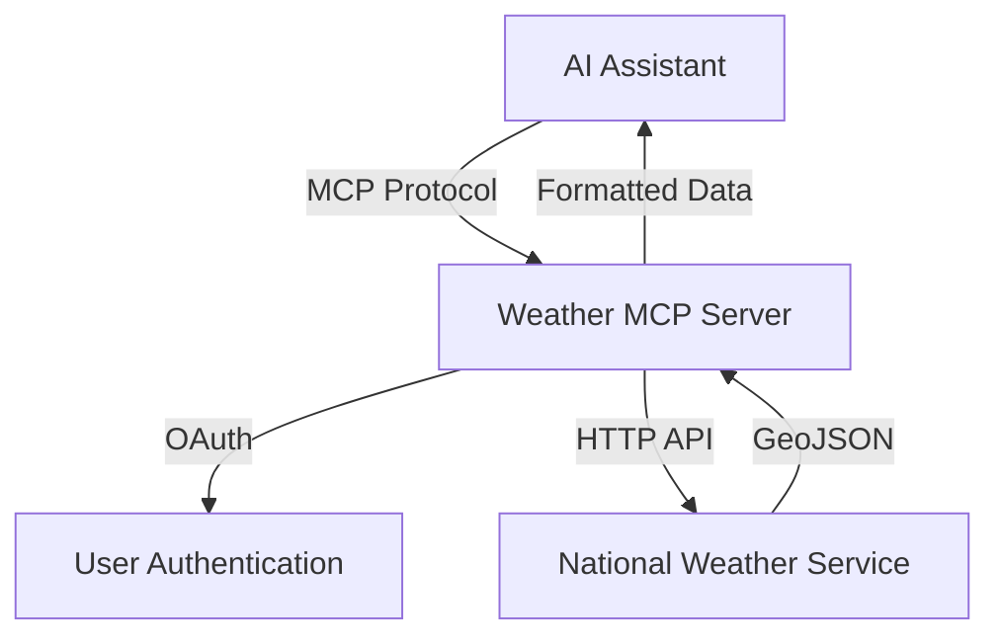

# 🌤️ Weather MCP Server

> A powerful, remote Model Context Protocol (MCP) server that brings real-time weather data to AI assistants and applications.

[](https://weather-mcp.genaijake.workers.dev)
[](https://typescriptlang.org)
[](https://modelcontextprotocol.io)

---

## 🎯 What This Does

Transform any AI assistant into a weather-savvy companion! This MCP server connects your AI to live weather data from the National Weather Service, providing:

- **🌡️ Detailed Weather Forecasts** - Get multi-day forecasts for any US location
- **⚠️ Real-time Weather Alerts** - Access active weather warnings and advisories
- **🔐 Secure OAuth Access** - Protected with industry-standard authentication
- **🌍 Global Deployment** - Accessible worldwide via Cloudflare's edge network

---

## 🚀 Quick Start

### For AI Assistant Users

**Live Server URL:** `https://weather-mcp.genaijake.workers.dev/sse`

#### Connect with Claude Desktop
Add this to your Claude Desktop configuration:

```json
{
  "mcpServers": {
    "weather": {
      "command": "npx",
      "args": ["mcp-remote", "https://weather-mcp.genaijake.workers.dev/sse"]
    }
  }
}
```

#### Test with MCP Inspector
```bash
npx @modelcontextprotocol/inspector
# Then connect to: https://weather-mcp.genaijake.workers.dev/sse
```

---

## 🛠️ Available Tools

### 🌦️ `get-forecast`
Get detailed weather forecasts for any US location using coordinates.

**Parameters:**
- `latitude` (number): Latitude (-90 to 90)
- `longitude` (number): Longitude (-180 to 180)

**Example Request:**
```json
{
  "latitude": 37.7749,
  "longitude": -122.4194
}
```

**Example Response:**
```
Forecast for 37.7749, -122.4194:

Tonight:
Temperature: 52°F
Wind: 5 mph W
Partly cloudy with patchy fog after midnight

Tuesday:
Temperature: 68°F
Wind: 10 mph NW
Sunny with areas of morning fog
---
```

### 🚨 `get-alerts`
Retrieve active weather alerts and warnings for any US state.

**Parameters:**
- `state` (string): Two-letter state code (e.g., "CA", "TX", "FL")

**Example Request:**
```json
{
  "state": "CA"
}
```

**Example Response:**
```
Active alerts for CA:

Event: High Wind Warning
Area: San Francisco Bay Area
Severity: Moderate
Status: Actual
Headline: High Wind Warning until Tuesday 10:00 AM PST
---
```

---

## 🏗️ For Developers

### Local Development

```bash
# Clone and setup
git clone <your-repo-url>
cd weather-mcp
npm install

# Start development server
npm run dev
# Server available at: http://localhost:8787/sse

# Type checking
npm run type-check

# Deploy to production
npm run deploy
```

### Project Structure
```
weather-mcp/
├── 🌐 src/
│   ├── index.ts      # Main MCP server with weather tools
│   ├── app.ts        # Web app and OAuth endpoints
│   └── utils.ts      # UI components and helpers
├── 📄 static/        # Static content and assets
├── 📚 docs/          # Documentation and project info
└── ⚙️ config files   # TypeScript, Wrangler, etc.
```

### API Architecture



---

## 🔒 Authentication & Security

This server implements **OAuth 2.0** for secure access:

1. **🔑 Client Registration** - Register your MCP client
2. **👤 User Authorization** - Users approve weather data access
3. **🎫 Token Exchange** - Secure token-based authentication
4. **🛡️ Scoped Permissions** - Granular access control

**Available Scopes:**
- `read_profile` - Basic profile information
- `read_data` - Access weather data
- `write_data` - Store weather preferences

---

## 🌍 Data Source & Coverage

Powered by the **[National Weather Service API](https://weather.gov/)** 🇺🇸
- ✅ **Official Government Data** - Trusted, accurate weather information
- ✅ **Real-time Updates** - Live alerts and current conditions
- ✅ **Comprehensive Coverage** - All US states and territories
- ❌ **US Only** - Due to NWS API limitations

---

## 💡 Usage Examples

### Weather Planning Assistant
```
User: "What's the weather like in Seattle this week?"
AI: Uses get-forecast tool with Seattle coordinates
Response: Detailed 7-day forecast with temperatures and conditions
```

### Emergency Weather Monitoring
```
User: "Are there any severe weather alerts in Florida?"
AI: Uses get-alerts tool with state code "FL"
Response: Current hurricane, tornado, or severe weather warnings
```

### Travel Weather Briefing
```
User: "I'm flying to Denver tomorrow, any weather concerns?"
AI: Combines forecast and alerts for comprehensive travel weather brief
```

---

## 🤝 Contributing

We welcome contributions! Here's how to get involved:

1. **🍴 Fork** the repository
2. **🌿 Create** a feature branch (`git checkout -b feature/amazing-feature`)
3. **💻 Code** your changes
4. **🧪 Test** thoroughly
5. **📤 Submit** a pull request

### Development Guidelines
- ✅ Follow TypeScript best practices
- ✅ Add proper error handling
- ✅ Update documentation
- ✅ Test with real weather data

---

## 📊 Status & Monitoring

| Component | Status | Notes |
|-----------|--------|-------|
| 🌐 **Server** | ✅ Live | `weather-mcp.genaijake.workers.dev` |
| 🌦️ **Weather API** | ✅ Active | National Weather Service |
| 🔐 **OAuth** | ✅ Functional | User authentication working |
| 📡 **MCP Protocol** | ✅ Compatible | Latest MCP SDK |

---

## 📝 License

This project is licensed under the **MIT License** - see the [LICENSE](LICENSE) file for details.

---

## 🆘 Support & Resources

- **🐛 Issues**: [GitHub Issues](../../issues)
- **📖 MCP Docs**: [Model Context Protocol](https://modelcontextprotocol.io)
- **🌦️ NWS API**: [Weather.gov API Docs](https://weather.gov/documentation/services-web-api)
- **☁️ Cloudflare Workers**: [Workers Documentation](https://developers.cloudflare.com/workers/)

---

<div align="center">

**⭐ Star this repo if you find it useful!**

Made with ❤️ and lots of ☕ for the AI community

</div>
